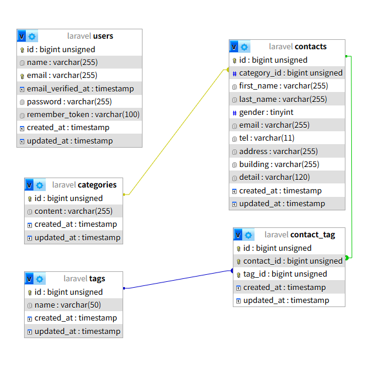

プロジェクト名:COACHTECH お問い合わせフォーム

概要:
fortifyを利用した,認証機能の設定。
バリデーション失敗時のエラーメッセージ表現。
ControllerでN+1問題の制御によりサーバー読み取りの負荷軽減。
fputs,fopen,fclose関数の使い方の勉強。
ポストマンの使い方の練習。

ER図:
CATEGORIES ||--o{ 
CONTACTS 一つの問い合わせ分類は,多くの問い合わせ内容に対応するが,一つの問い合わせ内容は一つの問い合わせ分類に属する。(1:多)

CONTACTS }o--o{ TAGS  
一つの問い合わせ内容は複数のタグを持ち,一つのタグは複数の問い合わせ内容に対応する。(多:多) 

環境構築手順:
git clone後,cp .env.example .env

Laravel Sailのインストール

docker run --rm
-u "$(id -u):$(id -g)"
-v "$(pwd):/var/www/html"
-w /var/www/html
-e COMPOSER_CACHE_DIR=/tmp/composer_cache
laravelsail/php82-composer:latest
composer require laravel/sail --dev

Sailの設定ファイルをパブリッシュ（MySQLを選択） docker run --rm
-u "$(id -u):$(id -g)"
-v "$(pwd):/var/www/html"
-w /var/www/html
-e COMPOSER_CACHE_DIR=/tmp/composer_cache
laravelsail/php82-composer:latest
php artisan sail:install --with=mysql

Sailの起動 sail up -d

アプリケーションキーの生成 sail artisan key:generate

データベースのマイグレーションと初期データ投入 sail artisan migrate:fresh --seed

フロントエンドのセットアップ 

sail npm install 

sail npm install -D tailwindcss@^3.4.0 postcss autoprefixer 

sail npm install alpinejs

Vite開発サーバーの起動 

sail npm run dev

使用技術:
HTML+CSS+Javascript(bootstrap,tailwind,node)
PHP,Laravel 10, MySQL 8.0, Nginx, Docker
APIエンドポイント一覧:
/api/v1/contacts,/api/v1/contacts/{contact},/api/v1/contacts,/api/v1/contacts/{contact},/api/v1/contacts/{contact}
開発環境URL:
http://localhost(127.0.0.1)mysql(:8080)
作成者:高橋 秀和
